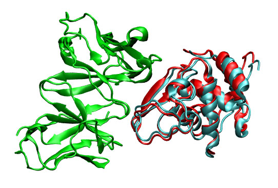

# FRODOCK

FRODOCK (Fast Rotational DOCKing) generates very efficiently many potential predictions of how two proteins could interact from their 3D coordinates. This approximation effectively addressed the complexity and sampling requirements of the initial 6D docking exhaustive search by combining the projection of the interaction terms into 3D grid-based potentials with the efficiency of spherical harmonics approximations. This initial stage exhaustive docking approach obtained excellent accuracy results with standard benchmarks in just a few minutes. Please also check our protein-protein server <a href="https://frodock.chaconlab.org/"> FRODOCK </a></p>

- J.I. Garzón, J.R. Lopéz-Blanco, C. Pons, J. Kovacs, R. Abagyan, J. Fernández-Recio, P. Chacón (2009) FRODOCK: a new approach for fast rotational protein-protein docking Bioinformatics, 25, 2544-2551 <a href="http://www.ncbi.nlm.nih.gov/pubmed/19620099?itool=EntrezSystem2.PEntrez.Pubmed.Pubmed_ResultsPanel.Pubmed_RVDocSum&amp;ordinalpos=1"></a><a href="httpd://chaconlab.org/PDF/bioinf2009.pdf"> </a>
- E. Ramírez-Aportela, J.R. López-Blanco, P. Chacon (2016). FRODOCK 2.0: Fast Protein-Protein docking server. Bioinformatics 2016 32 (15), 2386-8 <a href="https://doi.org/10.1093/bioinformatics/btw141"></a><a href="http://chaconlab.org/PDF/bioinf2016.pdf"> </a>

## USAGE
The docking process will be carried out in four consecutive steps:

1. Check PDB input files
2. Potential maps generation
3. Perform the exhaustive docking search
4. Clustering and visualization of predictions.

### STEP 1. Check PDB input files

The input coordinates of both ligand and receptor proteins should conform to PDB format. Be aware of missing atoms, alternative conformations, bad place atoms and a long etc. that can eventually jeopardize your results. Please, use your favorite PDB checker to anticipate and fix any PDB error!

### STEP 2. Potential maps generation

All necessary potential maps must be pre-computed using FRODOCKGRID. Although vdw and electrostatics maps could be computed on the fly during the docking search, it is recommendable to create the maps beforehand in order to visualize them and check that they are consistent with the original structure. Here are the commands to generate the vdw, electrostatic, desolvation maps (receptor and ligand) in the illustrative example HyHel-5/lysozyme docking case.
```
> ../bin/frodockgrid 3hfl_fv.pdb -o 3hfl_fv_W.ccp4
> ../bin/frodockgrid 3hfl_fv.pdb -o 3hfl_fv_E.ccp4 -m 1
> ../bin/frodockgrid 3hfl_fv.pdb -o 3hfl_fv_DS.ccp4 -m 3
> ../bin/frodockgrid 3hfl_ly2.pdb -o 3hfl_ly2_DS.ccp4 -m 3
```
The receptor (3hfl_fv.pdb) and the ligand (3hfl_ly_ref.pdb) coordinates were extracted from 3hfl pdb entry of the Protein Data Bank. The ligand molecule was rotated randomly (3hfl_ly2.pdb, red on the left)to avoid pre-aligment situations.

<table border="0" cellspacing="2" cellpadding="0" align="center">
<tbody>
<tr>
<td></td>
<td align="center"> &rarr; FRODOCK &rarr;</td>
<td></td>
</tr>
</tbody>
</table>

You can check the appearance of the generated receptor potential maps with a viewer that supports ccp4 or situs. As an example, next it is shown from left to right and from top to bottom: the receptor structure, van der Waals, electrostatic, and desolvation maps. All of them were represented in the same pose using blue color for negative and red for positive potentials. For better display arbitrary visualization thresholds were used.</p>
<table border="0" cellspacing="0" cellpadding="0" align="center">
<tbody>
<tr>
<td></td>
<td></td>
<td></td>
<td></td>
</tr>
<tr>
<td></td>
<td></td>
<td></td>
<td></td>
</tr>  
</tbody>
</table>

### STEP 3. Perform the exhaustive docking search

Once the potential maps are generated, you are ready to perform the docking. To this end, use the following command including all the potentials (van der Waals, Electrostatic and desolvation):
```
> ../bin/frodock 3hfl_fv_ASA.pdb 3hfl_ly2_ASA.pdb -w 3hfl_fv_W.ccp4 -e 3hfl_fv_E.ccp4 --th 10 -d 3hfl_fv_DS.ccp4,3hfl_ly2_DS.ccp4 -o dock.dat
Reading receptor PDB
        * Receptor accessibility read from receptor PDB. 
                  Checking ASA in Occupancy column...
                - Ok. Occupancy column seems to show ASA values
        * Creating Accessibility map from receptor PDB...
        * Accessibility map created from receptor PDB
        * OK

Receptor VDW map information:
        * Receptor VDW map read from file
        * Map origin: -33.141129 -39.668289 -12.076756
        * Map size: 89 81 75

Receptor electrostatic map information:
        * Receptor electrostatic map read from file
        * Map modification. Threshold applied: 10.000000
        * Map origin: -33.141129 -39.668289 -12.076756
        * Map size: 89 81 75

Receptor desolvation map information:
        * Receptor electrostatic map read from file
        * Map origin: -24.141129 -30.668287 -3.076756
        * Map size: 71 63 57
        * Extra potential receptor maps
        *Number of read potentials: 0

Reading ligand pdb
        * Ligand center: 229.958908 23.243317 49.012619
        * Ligand accesilibility read from Ligand PDB. 
                  Checking ASA in Occupancy column...
                - Ok. Occupancy column seems to show ASA values
        * Ligand desolvation map read from file

Spherical radius
        * Receptor vdw radius in amstrongs: 71.000000 (71 spherical layers)
        * Ligand radius in amstrongs: 28.025059 (29 spherical layers)
        * Ligand electrostatic radius in amstrongs: 28.025059 (29 spherical layers)
        * Ligand accesibility radius in amstrongs: 28.025059 (29 spherical layers)
        * Ligand desolvation radius in amstrongs: 33.025059 (34 spherical layers)
        * Maximum ligand desolvation radius in amstrongs: 33.025059 (34 spherical layers)

Precomputation of spherical representation of ligand

Precomputation Fixed time: 43.110000 s
Determination of translational points to explore
        * Mask created
        * Number of points to explore: 18996 

Translational search init...
        * Translational search finished
        * Number of solutions: 69464    
```       
        
dock.dat is a binary file that stores all the docking solutions (ligand orientations and positions). 
Note for advanced users: The van der Waals potential term cannot be disabled; if it is not given as input it will be automatically computed. To avoid the electrostatic potential −−E option must be set to 0.0.

[!NOTE] MPI version works in the same way as the sequential version but it is possible to split the translational search in as many parallel processes as you have, speeding the docking considerably. The command for 6 processes is:
```
> mpirun -np 6 ../bin_mpi/frodock_mpi 3hfl_fv_ASA.pdb 1lza_ly2_ASA.pdb -w 3hfl_fv_W.ccp4 -e 3hfl_fv_E.ccp4 --th 10 -d 3hfl_fv_DS.ccp4,1lza_ly2_DS.ccp4 -o dock2_mpi.dat
```
[!CAUTION] The frodock_mpi requires dynamic links to a set MPI and system libraries. If the provided frodock_mpi does not work correctly with your MPI installation, check what libraries are needed (linux:>ldd ../bin/frodock_mpi) and what are included LD_LIBRARY_PATH (sometimes case a symbolic link can solve this problem). In any case, we recommend compilation of the code to avoid problems.

### STEP 4. Clustering and visualization of predictions 

Once the docking process has been performed it is possible to sort and cluster the solutions by:
```
../bin/frodockcluster dock.dat 3hfl_ly2.pdb --nc 100 -o clust_dock.dat
Sort process...
Maximum correlation: 1299.208740
Clustering process...      
```
This way a new solution file containing only 100 solutions is created. Each of these solutions represents the best element of the first 100 clusters created. The RMSD default value used in the clusterization is 5Å.

To visualize the 10 first solutions:
```
> ../bin/frodockview clust_dock.dat -r 1-10</div>
1  86.00  158.32  201.22    19.36    6.83   55.42    1359.015259
2 244.84   55.47  123.03    13.36    2.83   51.42    1340.471680
3 194.98   99.53  265.77    -6.64   14.83    9.42    1331.359131
4 314.93   81.77  144.80     5.36    2.83   51.42    1314.301514
5 307.26  142.28   57.47     7.36    6.83   51.42    1297.874390
6 350.57   90.12  270.98    -0.64   20.83   15.42    1283.359741
7 243.61   82.73   26.85    11.36    2.83   57.42    1268.607544
8 312.64  125.93   92.45     5.36   10.83   49.42    1267.174683
9 273.09  101.75   35.90     3.36    4.83   55.42    1237.752808
10 149.5  105.01  199.2     -0.64   18.83   11.42    1225.663574
```
Each line has the format: rank Euler1 Euler2 Euler3 posX posY PosZ correlation, where rank indicates the position of the solution, {Euler1,Euler2,Euler3} are the Euler angle rotation (in ZYZ convention) and {posX ,posY ,PosZ} is the X,Y,Z localization respect the center of mass of the ligand pdb (only C-alpha are used to center). Finally, the correlation is the absolute energy score obtained.

To generate the 3D coordinates of the predicted solutions:
```
../bin/frodockview clust_dock.dat -r 1-5 -p 3hfl_ly2.pdb
1  86.00  158.32  201.22    19.36    6.83   55.42   1359.01 => 3hfl_ly2_1.pdb
2 244.84   55.47  123.03    13.36    2.83   51.42   1340.47 => 3hfl_ly2_2.pdb
3 194.98   99.53  265.77    -6.64   14.83    9.42    1331.35 => 3hfl_ly2_3.pdb
4 314.93   81.77  144.80     5.36    2.83   51.42    1314.30 => 3hfl_ly2_4.pdb
5 307.26  142.28   57.47     7.36    6.83   51.42    1297.87 => 3hfl_ly2_5.pdb 
```
In this case, the first prediction (3hfl_ly2_3.pdb) is shown to be very similar to the real solution (3hfl_ly2_ref.pdb).
<table border="0" cellspacing="0" cellpadding="0" align="center">
<tbody>
<tr>
<td align="center"></td>
</tr>
</tbody>
</table>
You could employ an unbound ligand structure (PDB entry 1lza), despite presenting some challenging conformational changes frodock still gets the correct solution within top solutions.  

### HOW TO ADD CONSTRAINTS TO THE DOCKING?

The docking search can be constrained in two different ways.

#### Known amino acids involved in the interaction:

After the docking is done, frodockonstraits tool can discriminate/filter FRODOCK solutions that fulfill known distance conditions between ligand and receptor amino acids in the interface.  The distance constraints are stored in an input text file like this:         
```
RECEPT______LIGAND_____DIST 
-----------------------------------------
101          67        5.0
```
Using this file (constrainst.txt)  the command will be:
```
../bin/frodockonstraints clust_dock2.dat 3hfl_fv.pdb 1lza_ly2.pdb constraints.txt -o clust_dock2_C.dat
```
This will create a file (clust_dock2_C.dat) with solutions that show at least a pair of atoms (no hydrogens) from receptor amino acid 101 and ligand amino acid 67 with a distance shorter than 5.0 Å.

The constraint file can contain many conditions, one per line. To keep a solution, all conditions must be fulfilled.  For example, this file:
```
RECEPT______LIGAND_____DIST
-----------------------------------------
101          67        5.0
102         -1        10.0
-1           68       10.0
```
contains three conditions. The first implies that at least one atom pair from receptor amino acid 101 and ligand amino acid 67 must be closer than 5.0 Å. The second condition states that at least one atom from receptor amino acid 101 must be less than 10 Å of any atom from the ligand. The third states that at least one atom from ligand amino acid 68 must be less than 10 Å of any atom from the receptor. The three conditions must be fulfilled to keep a solution.

#### Known receptor binding site:

FRODOCK can also limit the translational exploration of the ligand location to a small region around a given position. This will be useful when the approximate position of the ligand can be predicted. The option “−−around X,Y,Z” determines the 3D position central point of the desired translational exploration, and option -th specifies the extension in amstrons.  Here is an example:
```
../bin/frodock 3hfl_fv_ASA.pdb 1lza_ly2_ASA.pdb -w 3hfl_fv_W.ccp4 -e 3hfl_fv_E.ccp4 --th 10 -d 3hfl_fv_DS.ccp4,1lza_ly2_DS.ccp4 -o dock_C.dat --around 20.0,6.0,54.0
../bin/frodockcluster dock_C.dat 1lza_ly2.pdb --nc 100 -d 5.0 -o clust_dock_C.dat
../bin/frodockview clust_dock_C.dat -r 11 -p 1lza_ly2.pdb
```
This restriction accelerates the docking search avoiding false predictions where the ligand is far from the receptor binding site.
