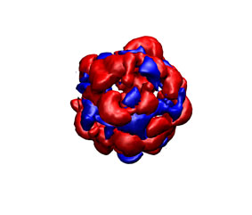

# FRODOCK

FRODOCK (Fast Rotational DOCKing) generates very efficiently many potential predictions of how  two proteins could interact from their 3D coordinates. 

## USAGE
The docking process will be carried out in four consecutive steps:

1. Check PDB input files
2. Potential maps generation
3. Perform the exhaustive docking search
4. Clustering and visualization of predictions.

### STEP 1. Check PDB input files

The input coordinates of both ligand and receptor proteins should conform to PDB format. Be aware of missing atoms, alternative conformations, bad place atoms and a long etc. that can eventually jeopardize your results. Please, use your favorite PDB checker to anticipate and fix any PDB error!

### STEP 1. Potential maps generation

All necessary potential maps must be pre-computed using FRODOCKGRID. Although vdw and electrostatics maps could be computed on the fly during the docking search, it is recommendable to create the maps beforehand in order to visualize them and check that they are consistent with the original structure. Here are the commands to generate the vdw, electrostatic, desolvation maps (receptor and ligand) in the illustrative example HyHel-5/lysozyme docking case.
```
> ../bin/frodockgrid 3hfl_fv.pdb -o 3hfl_fv_W.ccp4
> ../bin/frodockgrid 3hfl_fv.pdb -o 3hfl_fv_E.ccp4 -m 1
> ../bin/frodockgrid 3hfl_fv.pdb -o 3hfl_fv_DS.ccp4 -m 3
> ../bin/frodockgrid 3hfl_ly2.pdb -o 3hfl_ly2_DS.ccp4 -m 3
```
The receptor (3hfl_fv.pdb) and the ligand (3hfl_ly_ref.pdb) coordinates were extracted from 3hfl pdb entry of the Protein Data Bank. The ligand molecule was rotated randomly (3hfl_ly2.pdb, red on the left)to avoid pre-aligment situations.

<table border="0" cellspacing="2" cellpadding="0" align="center">
<tbody>
<tr>
<td></td>
<td align="center"> &rarr; FRODOCK &rarr;</td>
<td></td>
</tr>
</tbody>
</table>

You can check the appearance of the generated receptor potential maps with a viewer that supports ccp4 or situs. As an example, next it is shown from left to right and from top to bottom: the receptor structure, van der Waals, electrostatic, and desolvation maps. All of them were represented in the same pose using blue color for negative and red for positive potentials. For better display arbitrary visualization thresholds were used.</p>
<table border="0" cellspacing="0" cellpadding="0" align="center">
<tbody>
<tr>
<td></td>
<td></td>
<td></td>
<td></td>
</tr>
<tr>
<td></td>
<td></td><td></td>
<td></td>
</tr>  
</tbody>
</table>
